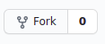

# Restaurant App

[saboresbogota.com](https://saboresbogota.com) (live version)

## Set Up
___
### Fork this repository (requires you to have github account)
[](https://github.com/dj1969/restaurant-app.git/fork)

### Create GCP account


services used:  
* google secrets manager
* cloud run
* cloud build
* google cloud storage
* google firestore NoSQL database
* cloud dns + cloud run domain mapping
  
configurations required: 
* create service account for cloud run service that has the Secret Manager Secret Accessor permission
* download json key file for above service account and upload it to secrets manager, copy secret path and either set as another environment variable or (how I have it currently) hard code it; this has to be passed into the secretmanager library (has to be installed/not part of the google.cloud standard library) and then passed into the credentials parameter when initializing the storage_client library
* set environment variables in cloud run SECRET_KEY, GOOGLE_STORAGE_BUCKET; SECRET_KEY is needed for flask session to work
* create storage bucket manually with two folders, /static and /user-images, set bucket to be publically accessible
* under cloud domains, make sure to check "Use Cloud DNS (Recommended)" for the domain; when configuring record sets in cloud dns, leave DNS Name field blank and put all 4 ip addresses in the A record set, ditto for AAAA
* set up continous deployment on cloud run

challenges:  
* recreating models.py file with firestore, thankfully firestore documentation for adding [custom objects](https://firebase.google.com/docs/firestore/manage-data/add-data) which helps in creating object oriented models similar to sqlalchemy workflow 
* still not 100% how flask-login works, but was able to get it to work by passing a user object that inherits the UserMixin class into login_user() and creating a staticmethod get() that's based on username to use in the @user_loader decorator/route (as per docs)


local development environment variables (added to bottom of .bashrc file):
```
export FLASK_ENV=development
export FLASK_APP=main.py
export GOOGLE_APPLICATION_CREDENTIALS=key.json
```

requires download of service key json file, naming it key.json, and putting into root of application (so that when developing/testing locally the services are all authenticated), do not forget to add key.json to .gitignore

To implement a 'Test' step in the CI/CD pipeline, as seen below:


Unless all tests pass, the new revision does not deploy.

Had to add the following to the Cloud Build Trigger cloudbuild.yaml file:
```
steps:
  - name: '$_GCR_HOSTNAME/$PROJECT_ID/$REPO_NAME/$_SERVICE_NAME:$COMMIT_SHA'
    args:
      - python
      - '-m'
      - unittest
      - discover
      - '--verbose'
      - '-s'
      - ./tests/
      - '-p'
      - '*_test.py'
    id: Test
    secretEnv:
      - GOOGLE_APPLICATION_CREDENTIALS_TEXT
availableSecrets:
  secretManager:
    - versionName: projects/689769360983/secrets/service_account_key/versions/1
      env: GOOGLE_APPLICATION_CREDENTIALS_TEXT
```
also had to allow cloud build service account the permission secret manager secret accessor
[inspiration](https://stackoverflow.com/questions/55022058/running-python-unit-test-in-google-cloud-build)
